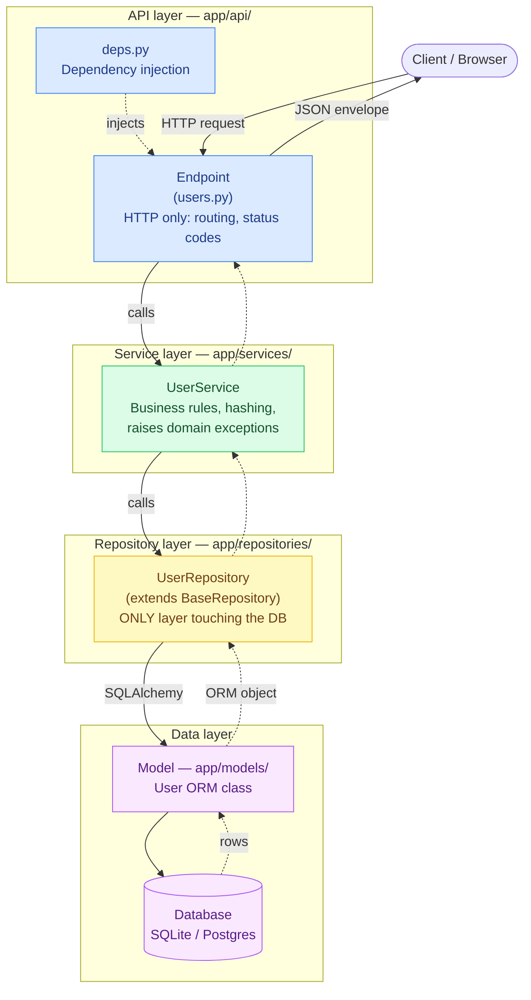
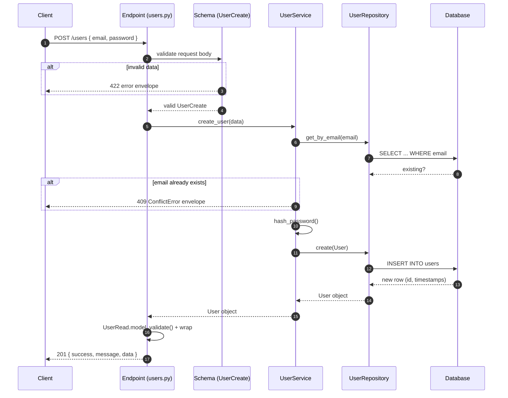
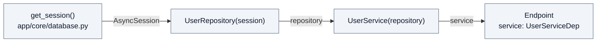
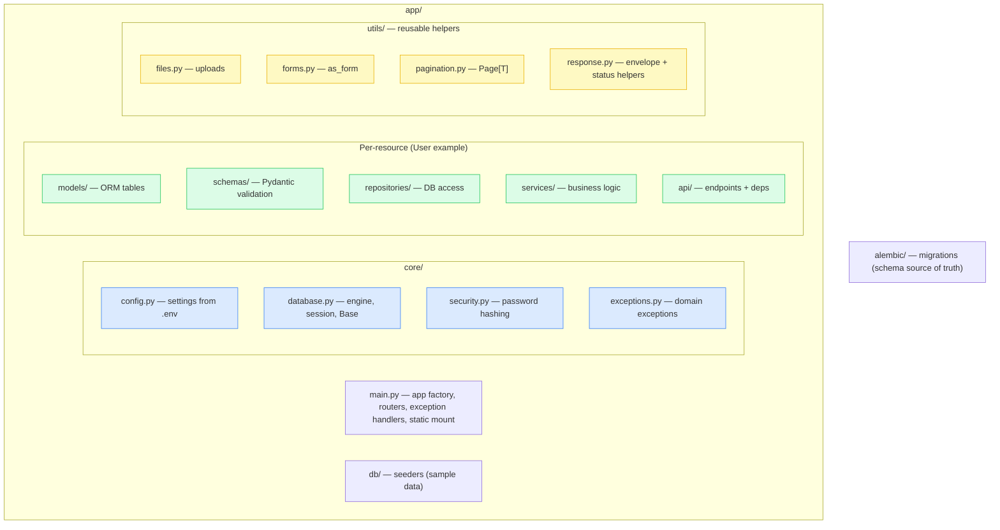
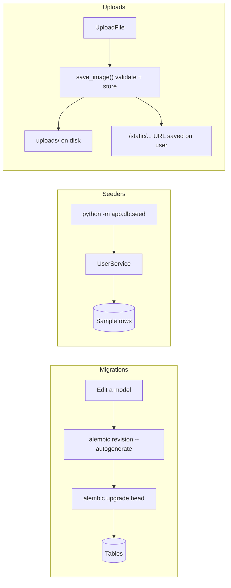

# Architecture & Request Flow

Visual guide to how a request travels through the layers.
(GitHub and VSCode's Markdown preview render the Mermaid diagrams below.)

## 1. Layered architecture

## 2. Request flow — `POST /api/v1/users` (create user)

## 3. Dependency injection chain

Every request builds this chain automatically (see `app/api/deps.py`):

## 4. Folder responsibilities

## 5. Supporting flows

